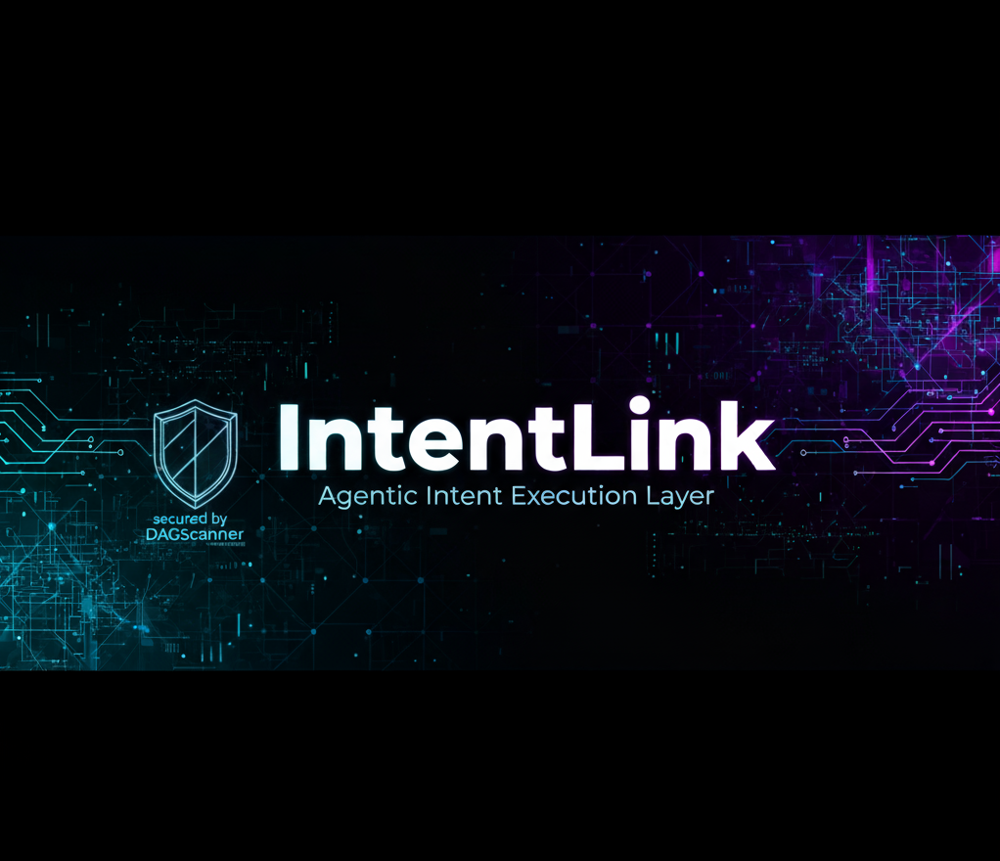

<!-- PROJECT BANNER -->
<p align="center">
  <a href="https://github.com/SheriffMudasir/IntentLink">
    
  </a>
</p>

<br />

<h1 align="center">🚀 IntentLink Backend</h1>
<h3 align="center">Your AI Copilot for Secure, Multi-Chain DeFi on BlockDAG</h3>

<p align="center">
  <!-- GitHub Badges -->
  <a href="https://github.com/SheriffMudasir/IntentLink/stargazers">
    
  </a>
  <a href="https://github.com/SheriffMudasir/IntentLink/blob/main/LICENSE">
    
  </a>
  <!-- Project Badges -->
  <a href="https://blockdag.network/hackathon">
    
  </a>
  
</p>

---

## 🎯 Implementation Status

### ✅ **Phase 1: Core Intent Pipeline** - COMPLETE

- ✅ Intent parsing with natural language input
- ✅ Structured intent representation (JSON)
- ✅ Database models (Intent, Plan, Execution)
- ✅ RESTful API with Django-Ninja
- ✅ PostgreSQL database integration
- ✅ Docker containerization

### ✅ **Phase 2: Security Validation** - COMPLETE

- ✅ GoPlus API integration for security checks
- ✅ Token security validation (honeypot detection)
- ✅ Deployer address security checks
- ✅ Safety scoring and risk assessment
- ✅ Redis caching for API responses
- ✅ Candidate protocol ranking by utility

### ✅ **Phase 3: Multi-Chain Support** - COMPLETE

- ✅ **BlockDAG Awakening Testnet** (Chain ID: 1043)
  - IntentWallet: `0x718a09981d305c2293d0c85e9d957ad25cb2a1c7`
  - MockDEX, MockStaking, MockLending contracts
- ✅ **Polygon Amoy Testnet** (Chain ID: 80002)
  - Same IntentWallet & MockDEX addresses
  - Chain-specific MockStaking & MockLending
- ✅ Dynamic chain configuration in `NETWORK_CONFIG`
- ✅ Chain-specific RPC URL selection
- ✅ Whitelisted protocol management per chain

### ✅ **Phase 4: Cryptographic Security** - COMPLETE

- ✅ **EIP-712 Structured Data Signing**
  - Domain separator for IntentLink protocol
  - Typed data generation for frontend
- ✅ **Signature Verification**
  - Address recovery from ECDSA signatures
  - User authentication via cryptographic proof
- ✅ **Plan Commitment**
  - PlanId hash (keccak256 of UUID)
  - PlanHash (commitment to contract + amount)
- ✅ **Security Features**
  - Chain-specific signature binding
  - Time-limited authorization (1hr expiry)
  - Nonce infrastructure for replay protection
- ✅ **New Endpoints**
  - `POST /prepare-signature/` - Generate EIP-712 payload
  - Enhanced `POST /submit-intent/` - Signature verification

### ✅ **Phase 5: Enhanced Logging & Monitoring** - COMPLETE

- ✅ Comprehensive logging across all endpoints
- ✅ Visual indicators (✅❌⚠️🔐🌐🔍📊)
- ✅ Structured log format with sections
- ✅ Detailed signature verification trail
- ✅ Security audit logging
- ✅ Django logging configuration in settings
- ✅ Console and file handlers
- ✅ Log rotation support

### 🔜 **Phase 6: Real On-Chain Execution** - NEXT

- ⏳ Web3.py transaction building
- ⏳ Relayer key management
- ⏳ Gas estimation per chain
- ⏳ Transaction submission to blockchain
- ⏳ Transaction monitoring and confirmation
- ⏳ Receipt parsing and event extraction

### 🔜 **Phase 7: Production Hardening** - FUTURE

- ⏳ Nonce tracking in database
- ⏳ Signature expiry validation
- ⏳ Rate limiting per user
- ⏳ Comprehensive test suite
- ⏳ CI/CD pipeline
- ⏳ Monitoring and alerting

---

This directory contains the core backend service for IntentLink. It is a Django project built with Django-Ninja that exposes a RESTful API for parsing, planning, simulating, and executing user intents on-chain.

> **🔗 Smart Contracts:** See the [`intentlink-contracts/`](./intentlink-contracts/) folder for Solidity contracts, deployment guides, and verification status.

## Table of Contents

- [Implementation Status](#-implementation-status)
- [Features](#-features)
- [Tech Stack & Architecture](#-tech-stack--architecture)
- [Smart Contracts](#-smart-contracts)
- [Local Development Setup](#-local-development-setup)
- [Project Structure](#-project-structure)
- [API Endpoints](#-api-endpoints)
- [Environment Variables](#-environment-variables)
- [Documentation](#-documentation)
- [Running Tests](#-running-tests)

---

## ✨ Features

### 🔐 **Security First**

- **EIP-712 Signature Verification:** Cryptographic proof of user consent required for all executions
- **GoPlus Security Integration:** Real-time honeypot and malicious contract detection
- **Chain-Specific Signatures:** Prevents cross-chain replay attacks
- **Whitelisted Protocols:** Only pre-approved contracts can be used

### 🌐 **Multi-Chain Ready**

- **BlockDAG Awakening Testnet** (Chain ID: 1043) - Native support
- **Polygon Amoy Testnet** (Chain ID: 80002) - Full integration
- **Dynamic Configuration:** Easy to add new chains via `NETWORK_CONFIG`
- **Chain-Aware Planning:** Automatically selects appropriate protocols per chain

### 🤖 **Intent-Based Architecture**

- **Natural Language Parsing:** "stake 1000 bdag" → Structured intent
- **Smart Plan Generation:** Evaluates multiple protocols and ranks by utility
- **Security Validation:** Each candidate protocol is security-checked before selection
- **Two-Step Execution:** Approve + Action (stake/lend) transaction flow

### 📊 **Observability & Monitoring**

- **Comprehensive Logging:** Detailed logs with visual indicators (✅❌⚠️🔐)
- **Request Tracing:** Full audit trail from intent → plan → signature → execution
- **Console & File Output:** Real-time terminal logs + persistent log files
- **Security Audit Trail:** All signature verifications are logged

### 🚀 **Production Ready**

- **Typed API:** Leverages Django-Ninja and Pydantic for a fully typed, self-documenting API.
- **Intent Processing Pipeline:** A secure, deterministic pipeline from natural language to transaction.
- **Asynchronous Task Execution:** Uses Celery and Redis for handling long-running tasks like simulation and transaction relaying without blocking the API.
- **Containerized:** Fully containerized with Docker and Docker Compose for consistent development and production environments.
- **Database Persistence:** PostgreSQL for reliable intent/plan/execution storage

---

## 🏗️ Tech Stack & Architecture

### Core Technologies

- **Framework:** Django 4.x with Django-Ninja (FastAPI-style routing)
- **API Layer:** Django-Ninja with Pydantic schemas
- **Database:** PostgreSQL 15
- **Cache & Message Broker:** Redis 7
- **Async Task Queue:** Celery with prefork workers
- **Web Server:** Gunicorn (production-ready WSGI)
- **Cryptography:** eth-account, Web3.py for EIP-712 signing
- **HTTP Client:** httpx for external API calls

### Security Stack

- **Signature Verification:** EIP-712 typed data signing & ECDSA recovery
- **Security Scanning:** GoPlus API integration
- **Contract Validation:** Whitelisted protocol system
- **Chain Binding:** Chain-specific signature domains

The backend consists of four primary services orchestrated by `docker-compose`:

1.  **`web`**: The Gunicorn server running the Django application and serving the API.
2.  **`db`**: PostgreSQL database for storing intents, plans, and executions.
3.  **`cache`**: Redis instance for caching (GoPlus results, access tokens) and Celery message broker.
4.  **`worker`**: Celery worker processing background jobs (execution queue).

---

## 🔗 Smart Contracts

### **Deployed & Verified Contracts**

All IntentLink smart contracts are **live and verified** on two testnets:

| Network                        | Chain ID | IntentWallet Address                         | Status      |
| ------------------------------ | -------- | -------------------------------------------- | ----------- |
| **BlockDAG Awakening Testnet** | 1043     | `0x718a09981d305c2293d0c85e9d957ad25cb2a1c7` | ✅ Verified |
| **Polygon Amoy Testnet**       | 80002    | `0x718a09981d305c2293d0c85e9d957ad25cb2a1c7` | ✅ Verified |

**Explorers:**

- BlockDAG: [View on BlockDAG Explorer](https://awakening.bdagscan.com/address/0x718a09981d305c2293d0c85e9d957ad25cb2a1c7)
- Polygon: [View on PolygonScan](https://amoy.polygonscan.com/address/0x718a09981d305c2293d0c85e9d957ad25cb2a1c7)

### **Contract Suite**

📁 **Location:** [`intentlink-contracts/`](./intentlink-contracts/)

- **IntentWallet.sol** - Core AA wallet with EIP-712 signature verification
- **MockDEX.sol** - Mock DEX protocol for testing
- **MockStakingFarm.sol** - Mock staking protocol
- **MockLending.sol** - Mock lending protocol

### **Documentation**

- 📖 [Smart Contracts README](./intentlink-contracts/README.md) - Architecture & integration guide
- 🚀 [Deployment Guide](./intentlink-contracts/DEPLOYMENT.md) - Step-by-step deployment instructions
- 🔐 [Signature Generator](./intentlink-contracts/utils/generateSignature.js) - EIP-712 signing utility

### **ABIs & Integration**

Pre-compiled ABIs for frontend/backend integration:

- `ABI/IntentWallet.json`
- `ABI/MockDEX.json`
- `ABI/MockStakingFarm.json`
- `ABI/MockLending.json`

---

## 🚀 Local Development Setup

### Prerequisites

- Docker
- Docker Compose
- Python 3.10+ (for local tooling, though the app runs in a container)

### Step-by-Step Guide

1.  **Clone the Repository:**
    If you are in the root directory:

    ```bash
    # (You are already here)
    ```

2.  **Navigate to the Backend Directory:**

    ```bash
    cd intentlink-backend
    ```

3.  **Create the Environment File:**
    Copy the example environment file. This file is ignored by Git and will hold your local secrets and configuration.

    ```bash
    cp .env.example .env
    ```

4.  **Configure Your `.env` File:**
    Open the newly created `.env` file and:

    - Generate and add a `SECRET_KEY` (see Django docs for generating one).
    - Add a test wallet private key for the `RELAYER_PRIVATE_KEY`.
    - Review other variables and adjust if necessary.

5.  **Build and Run the Docker Containers:**
    This command will build the Docker images and start all the services (`web`, `db`, `cache`, `worker`) in the background.

    ```bash
    docker-compose up --build -d
    ```

6.  **Run Database Migrations:**
    The first time you start the application, you need to create the database schema.

    ```bash
    docker-compose exec web python manage.py migrate
    ```

7.  **Create a Superuser (Optional):**
    This allows you to access the Django Admin interface.

    ```bash
    docker-compose exec web python manage.py createsuperuser
    ```

8.  **Access the APIs:**
    - The API is now running at `http://localhost:8000/api/`.
    - Interactive API documentation (Swagger UI) is available at `http://localhost:8000/api/v1/docs`.
    - The Django Admin is at `http://localhost:8000/admin/`.

---

## 📂 Project Structure

```
intentlink-backend/
├── api_v1/                     # Django app for API Version 1
│   ├── migrations/             # Database migrations
│   ├── models.py               # Intent, Plan, Execution models
│   ├── schemas.py              # Pydantic I/O schemas
│   ├── api.py                  # API endpoint definitions
│   ├── tasks.py                # Celery async tasks
│   └── admin.py                # Django admin configuration
├── intentlink_project/         # Main Django project
│   ├── settings.py             # Core settings + logging config
│   ├── urls.py                 # Root URL routing
│   ├── celery.py               # Celery app configuration
│   └── wsgi.py                 # WSGI entry point
├── services/                   # Business logic services
│   ├── signature_service.py    # EIP-712 signing & verification
│   ├── security_service.py     # GoPlus API integration
│   └── relayer_service.py      # Transaction relaying (future)
├── ABI/                        # Smart contract ABIs
│   ├── IntentWallet.json
│   ├── MockDEX.json
│   ├── MockStaking.json
│   └── MockLending.json
├── data/                       # Contract deployment data
│   ├── BlockDAG Awakening Testnet/
│   └── Polygon Amoy Testnet/
├── logs/                       # Application logs
│   └── intentlink.log
├── .env                        # Environment configuration
├── docker-compose.yml          # Service orchestration
├── Dockerfile                  # Container image definition
├── requirements.txt            # Python dependencies
├── MULTI_CHAIN_CONFIG.md       # Multi-chain documentation
├── PHASE_4_CRYPTOGRAPHIC_SECURITY.md
├── PHASE_4_SUMMARY.md
├── PHASE_4_TESTING.md
├── LOGGING_GUIDE.md
└── README.md                   # This file
```

---

## 🔌 API Endpoints

All endpoints are prefixed with `/api/v1/`. See the live docs at `http://localhost:8000/api/v1/docs` for detailed request/response models.

### Core Intent Pipeline

#### **POST /parse-intent/**

Parses natural language input into a structured intent.

**Request:**

```json
{
  "input": "stake 1000 bdag",
  "user_wallet": "0xYourAddress",
  "chain_id": 1043
}
```

**Response:**

```json
{
  "intent_id": "uuid",
  "status": "PARSED",
  "intent": {
    "intent_type": "stake_and_compound",
    "asset": "BDAG",
    "amount": 1000.0,
    "amount_unit": "token",
    "target": "highest_risk_adjusted_apr"
  }
}
```

#### **POST /plan/**

Generates an execution plan with security validation.

**Request:**

```json
{
  "intent_id": "uuid"
}
```

**Response:**

```json
{
  "plan_id": "uuid",
  "candidates": [
    {
      "address": "0x1b227...",
      "apy": 0.12,
      "tvl": 500000,
      "safety_score": 100,
      "utility": 0.56,
      "warnings": [],
      "protocol": "staking"
    }
  ],
  "chosen": {
    /* Best candidate */
  }
}
```

### 🔐 Signature & Execution

#### **POST /prepare-signature/** ⭐ NEW

Generates EIP-712 typed data for user to sign.

**Request:**

```json
{
  "plan_id": "uuid"
}
```

**Response:**

```json
{
  "typed_data": {
    "types": {
      /* EIP-712 types */
    },
    "domain": {
      /* IntentLink domain */
    },
    "message": {
      "planId": "0x...",
      "planHash": "0x...",
      "nonce": 0,
      "expiry": 1732834800
    }
  },
  "plan_hash": "0x...",
  "nonce": 0,
  "expiry": 1732834800
}
```

#### **POST /submit-intent/** ⭐ ENHANCED

Verifies signature and queues execution (requires valid signature).

**Request:**

```json
{
  "plan_id": "uuid",
  "signature": "0x...",
  "nonce": 0,
  "expiry": 1732834800
}
```

**Response (Success):**

```json
{
  "execution_id": "uuid",
  "status": "PENDING"
}
```

**Response (Invalid Signature):**

```json
{
  "detail": "Invalid signature. You are not authorized to execute this plan."
}
```

#### **GET /execution/{execution_id}/status/**

Retrieves the status of an execution.

**Response:**

```json
{
  "execution_id": "uuid",
  "status": "CONFIRMED",
  "tx_hash": "0xabcd1234...",
  "logs": ["Transfer", "Stake", "IntentExecuted"]
}
```

---

## 🔑 Environment Variables

The application is configured entirely through environment variables. See `.env.example` for a complete list. Key variables include:

| Variable               | Description                                                                  |
| :--------------------- | :--------------------------------------------------------------------------- |
| `SECRET_KEY`           | **Required.** Django's secret key for cryptographic signing.                 |
| `DEBUG`                | Set to `True` for development, `False` for production.                       |
| `POSTGRES_DB`          | Name of the PostgreSQL database.                                             |
| `POSTGRES_USER`        | Username for the PostgreSQL database.                                        |
| `POSTGRES_PASSWORD`    | Password for the PostgreSQL database.                                        |
| `REDIS_URL`            | Connection URL for the Redis instance.                                       |
| `BLOCKDAG_RPC_URL`     | RPC endpoint for the BlockDAG Awakening Testnet (Chain ID: 1043).            |
| `POLYGON_AMOY_RPC_URL` | RPC endpoint for the Polygon Amoy Testnet (Chain ID: 80002).                 |
| `GOPLUS_API_KEY`       | GoPlus Labs API key for security checks.                                     |
| `GOPLUS_API_URL`       | GoPlus API base URL.                                                         |
| `GOPLUS_APP_KEY`       | GoPlus application key.                                                      |
| `RELAYER_PRIVATE_KEY`  | **Required for dev.** Private key of the wallet used to submit transactions. |

---

## 📚 Documentation

Comprehensive guides are available in the following files:

### **Backend Documentation**

- **[MULTI_CHAIN_CONFIG.md](MULTI_CHAIN_CONFIG.md)** - Multi-chain setup guide (BlockDAG + Polygon Amoy)
- **[PHASE_4_CRYPTOGRAPHIC_SECURITY.md](PHASE_4_CRYPTOGRAPHIC_SECURITY.md)** - EIP-712 signature system implementation details
- **[PHASE_4_SUMMARY.md](PHASE_4_SUMMARY.md)** - Phase 4 completion summary
- **[PHASE_4_TESTING.md](PHASE_4_TESTING.md)** - Integration testing guide with examples
- **[LOGGING_GUIDE.md](LOGGING_GUIDE.md)** - Comprehensive logging system documentation

### **Smart Contracts Documentation**

- **[intentlink-contracts/README.md](./intentlink-contracts/README.md)** - Contract architecture & security features
- **[intentlink-contracts/DEPLOYMENT.md](./intentlink-contracts/DEPLOYMENT.md)** - Deployment guide with verified addresses

---

## 🧪 Running Tests

We will build a comprehensive testing suite

```

```
